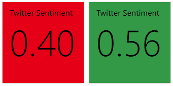
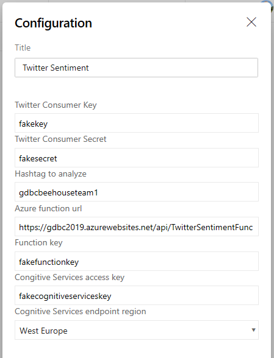

# Twitter Sentiment Dashboard Widgets
* NOTE: This works with Azure DevOps and Azure DevOps Server (Team Foundation Server). 

## Twitter Sentiment Widget
This widget displays the current sentiment for specific #hashtag with the help of Azure Cognitive Services and Azure Function.

The following configuration options are available:

## Requires the setup of azure cognitive services, azure function and twitter application
Instructions on how to deploy prerequisites can be found [here](https://github.com/solidify/twittersentimentanalysisinazure).